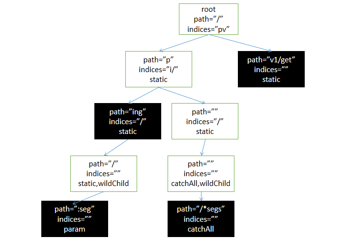

# Gin router analysis 2

> The fastest full-featured web framework for Go.

> Radix tree based routing, small memory foot print. No reflection. Predictable API performance.

官方声称Gin是最快的功能完整的Go web框架，本文研究下其实现细节。

## 路由的注册

前一篇文章分析中已知handler最终落到`group.engine.addRoute(httpMethod, absolutePath, handlers)`，所以本文从addRoute开始分析。

```golang
func (engine *Engine) addRoute(method, path string, handlers HandlersChain) {
	... // 1. 参数检查与打印一些调试信息
	root := engine.trees.get(method)
	if root == nil { // 2. 惰性创建相关method的root node
		root = new(node)
		root.fullPath = "/"
		engine.trees = append(engine.trees, methodTree{method: method, root: root})
	}
    // 3. 往root node中注册handlers
	root.addRoute(path, handlers)
}
```

从这段代码中我们还知道这么几件事：
1. path -> handlers的映射关系维护在tree(node)中
2. 每个method一个独立的tree
3. 从命名上我们可以大致猜测出这就是个树形结构

在更深入实现细节前，先回顾下`路由参数`的概念。

url路径中存在两种通配符。`:`可以匹配一段路径，`*`可以匹配0或n段路径

```
1.) path = /user/:name  

此handler会匹配 /user/john 但不会匹配 /user/ 或者 /user

2.) path = /user/:name/*action
此 handler 将匹配 /user/john/ 和 /user/john/send
如果没有其他路由匹配 /user/john，它将重定向到 /user/john/
```

### node

再来看看node的数据结构。

```golang
type node struct {
	path      string	// 当前节点path，一段或多段segment，例如 /a/b，/:param等等
	indices   string	// 索引，存储子节点的首字符
	children  []*node	// 子节点
	handlers  HandlersChain	// handlers方法
	priority  uint32	// 路径包含该节点的handler数量，即路由经由该节点的handler数
	nType     nodeType	// 节点类型
	maxParams uint8		// 该节点之后的路径参数个数
	wildChild bool		// child是否为通配符，若true，则其child的path就带:或*
	fullPath  string	// 完整路径
}

// 节点类型
const (
	static nodeType = iota // default // 普通节点，不含路径参数
	root	// 根节点
	param	// 路径参数节点，通配符:代表的节点
	catchAll	// 通配符*代表的节点
)
```

此外还有几个结构体要注意，先列出来：

```golang
type Param struct {
	Key   string
	Value string
}

type Params []Param

type methodTree struct {
	method string
	root   *node
}

type methodTrees []methodTree
```

#### node.addRoute

分析下engine.addRoute最终调用的node.addRoute方法。

```golang
func (n *node) addRoute(path string, handlers HandlersChain) {
	// 注意：随着代码的进行，n可能指向不同的对象，path也在不断地缩短，handlers保持不变
	fullPath := path
	n.priority++
	numParams := countParams(path)	// 计算路径参数个数，即path中:和*的个数

	// 当前节点没有设置path和children，则只可能是root节点，直接调用insertChild（见下一小节）
	if len(n.path) == 0 && len(n.children) == 0 {
		n.insertChild(numParams, path, fullPath, handlers)
		n.nType = root
		return
	}

	parentFullPathIndex := 0

walk:
	for {
		// Update maxParams of the current node
		if numParams > n.maxParams {
			n.maxParams = numParams
		}

		// 找到path和当前node.path的最长前缀；其中不可能包含:或*
		i := longestCommonPrefix(path, n.path)

		// Split edge
		// node.path并不是path的前缀，h则进行对node的拆分
		if i < len(n.path) {
			child := node{	// 新节点继承了原节点的一切
				path:      n.path[i:],	// 公共前缀之后的路径
				wildChild: n.wildChild,
				indices:   n.indices,
				children:  n.children,
				handlers:  n.handlers,
				priority:  n.priority - 1,	// 新节点权重减小
				fullPath:  n.fullPath,
			}

			// Update maxParams (max of all children)
			for _, v := range child.children {
				if v.maxParams > child.maxParams {
					child.maxParams = v.maxParams
				}
			}

			n.children = []*node{&child}	// node的子节点只有刚创建的节点
			// []byte for proper unicode char conversion, see #65
			n.indices = string([]byte{n.path[i]})
			n.path = path[:i] // node的path被截断
			n.handlers = nil	// 注册的handlers被置为空
			n.wildChild = false
			n.fullPath = fullPath[:parentFullPathIndex+i] // fullPath被截断
		}

		// Make new node a child of this node
		// path并不是node.path的前缀，需要在当前node之后挂新的child
		// 由于此前已经截断过node.path，所以此处判断的前提是node.path必然已是path的前缀
		if i < len(path) {
			path = path[i:]	// 去除与node.path的公共前缀，剩下的path才是需要处理的

			if n.wildChild {	// 通过阅读node.insertChild，可知wildChild节点之后的节点必然是通配符节点
				parentFullPathIndex += len(n.path)
				n = n.children[0]	// 通配符节点
				n.priority++

				// Update maxParams of the child node
				if numParams > n.maxParams {
					n.maxParams = numParams
				}
				numParams--	// 由于当前节点为wildChild则表示下一个节点必然是通配符节点，numParams可先减1

				// Check if the wildcard matches
				// 判断n.path是当前path的前缀
				if len(path) >= len(n.path) && n.path == path[:len(n.path)] {
					// check for longer wildcard, e.g. :name and :names
					// len(n.path)>=len(path)结合上一判断条件，代表n.path完全等于path
					// 或者path是n.path头部的一或n个segemt
					if len(n.path) >= len(path) || path[len(n.path)] == '/' {
						// 例如：
						// path=:a和n.path=:a能够match
						// path=:a/a和n.path=:a能够match
						// path=:aa和n.path=:a不能match
						// path=:a和n.path=:aa不能match
						continue walk
					}
				}
				// 若不能匹配，将会panic
			
				...
			}

			// 经过之前的处理，目前的情况如下
			// 1. node.path与（此时的）path已无交集
			// 2. node非wildChild
			// 接下来要做的就是基于剩下的path构建新节点，注册为node的child

			c := path[0]

			// slash after param
			// param节点之后还存在节点的情况下，此时c == '/'表示当前path并不以通配符起始，取子节点代替node，直接进入下一轮
			if n.nType == param && c == '/' && len(n.children) == 1 {
				parentFullPathIndex += len(n.path)
				n = n.children[0]
				n.priority++
				continue walk
			}

			// Check if a child with the next path byte exists
			// 遍历indices，找到与c匹配的child，修改所有child的权重
			// 将node置为匹配的child，进入下一轮
			for i, max := 0, len(n.indices); i < max; i++ {
				if c == n.indices[i] {
					parentFullPathIndex += len(n.path)
					i = n.incrementChildPrio(i)
					n = n.children[i]
					continue walk
				}
			}

			// Otherwise insert it
			// 没有任何一个child的path和当前的path有公共前缀，且c非通配符的情况下
			if c != ':' && c != '*' {
				// []byte for proper unicode char conversion, see #65
				n.indices += string([]byte{c})
				// 创建一个全新的节点，加入到node的children中，并调整所有之前已存在的child的权重
				child := &node{
					maxParams: numParams,
					fullPath:  fullPath,
				}
				n.children = append(n.children, child)
				n.incrementChildPrio(len(n.indices) - 1)
				n = child
			}
			// 调用insertChild完成节点的注册
			n.insertChild(numParams, path, fullPath, handlers)
			return
		}

		// Otherwise and handle to current node
		if n.handlers != nil {
			panic("handlers are already registered for path '" + fullPath + "'")
		}
		// 此时node.path == path
		n.handlers = handlers
		return
	}
}
```

主要流程：
1. 如果是root节点，直接调用insertChild
2. 非root节点时，进入walk loop
	1. 计算当前node.path和path的公共前缀
	2. 假设node.path并不是path的前缀
		1. 新建一个节点，将原节点的一系列数据转移过去
		2. 原节点的path置为计算出的公共前缀，将其他信息重置
		3. node指向新节点
	3. 经过一番处理，此时的node.path必然已是path的前缀
		1. 当node.path与path不相等时（node.path是path的前缀，但不是完整的path）
			1. path减去前缀node.path部分
			2. 如果当前node是wildChild
				1. node直接指向其child
				2. 确保当前path不会与node.path产生冲突
				3. 直接进入下一轮
			3. 如果当前node为param节点，且存在child，而且path以/起始。以child替换node，进入下一轮
			4. 遍历indices，寻找与c匹配的indice。若找到则调整所有child的权重，并以匹配的child替换node，进入下一轮
			5. 如果当前node的所有child的path都和当前path无公共前缀，则往node的children中添加新节点，node指向新节点
			6. 调用insertChild
		2. 当node.path与path完全相等时，直接往node上注册handlers

#### node.insertChild

```golang
func (n *node) insertChild(numParams uint8, path string, fullPath string, handlers HandlersChain) {
	// 注意：n指向的对象在下面的代码中可能会不断变化，path会不断缩短，fullPath/handlers会保持不变
	for numParams > 0 {
		// Find prefix until first wildcard
		wildcard, i, valid := findWildcard(path) // 找到第一个通配符，返回该通配符的segment和其位置，并检验是否合法（通配符后接/或处于path末尾是合法的，即不存在两个连续的通配符）
		if i < 0 { // No wildcard found // 当前path中已不存在通配符的情况下跳出循环；在整个for循环中，path的长度会不断减少
			break
		}

		... 
		// 进行检查 确保满足：
		// 1. path中通配符合法，即一个segment只存在一个:或*
		// 2. 路径参数必须有一个名字，所以该segment长度必须大于1
		// 3. node不允许已存在child

		if wildcard[0] == ':' { // param // 当前path的第一个segment是通配符:
			if i > 0 {
				// 设置parent的path，这是一段不含任何通配符的path
				n.path = path[:i]
				// 从通配符开始的剩余path
				path = path[i:]
			}

			n.wildChild = true // 指明是通配符节点
			child := &node{		// 创建新节点
				nType:     param,     // 节点类型
				path:      wildcard,  // 当前节点的path，由于是wildcard，实则就是一段segment
				maxParams: numParams, // 从当前节点往后（递归遍历其child）存在多少个param
				fullPath:  fullPath, // handler的完整路径，后续搜索时可以根据这个判断，node是否可对应handler
			}
			n.children = []*node{child} // 将创建的节点注册为父亲节点的child
			n = child		// 之后若继续处理，则以刚创建的child为父亲节点
			n.priority++	// 即将刚创建的child的priority设置为1
			numParams--		// 剩余路径参数减少

			// 如果当前处理的segment不是最后一段，那么为剩余的path创建新的子节点，进入下一轮
			if len(wildcard) < len(path) {
				path = path[len(wildcard):]

				child := &node{
					maxParams: numParams,
					priority:  1,
					fullPath:  fullPath,
				}
				n.children = []*node{child}
				n = child
				continue
			}

			// 直到path不再有剩余，设置handlers并结束
			n.handlers = handlers
			return
		}

		// 排除当前第一个segment是通配符:的情况，剩下自然是处理*的情况，剩下自然是处理
		// 由于*可以匹配0或n个segment，所以最终只会往parent上注册一个child就可以，而不需要考虑child的child

		...
		// 进行检查 确保满足
		// 1. 含*的segment之后没有其他segment；当前path中只存在一个通配符
		// 2. parent的path不以/结尾

		// currently fixed width 1 for '/'
		i--
		if path[i] != '/' { // 确保*前是/
			panic("no / before catch-all in path '" + fullPath + "'")
		}

		n.path = path[:i]

		// First node: catchAll node with empty path
		child := &node{
			wildChild: true,
			nType:     catchAll,
			maxParams: 1,
			fullPath:  fullPath,
		}
		// update maxParams of the parent node
		if n.maxParams < 1 {
			n.maxParams = 1
		}
		n.children = []*node{child}
		n.indices = string('/')
		n = child
		n.priority++ //priority设置为1

		// second node: node holding the variable
		child = &node{
			path:      path[i:],
			nType:     catchAll,
			maxParams: 1,
			handlers:  handlers,
			priority:  1,
			fullPath:  fullPath,
		}
		n.children = []*node{child}

		return
	}

	// If no wildcard was found, simply insert the path and handle
	n.path = path
	n.handlers = handlers
	n.fullPath = fullPath
}
```

主要流程：
1. 在numParams > 0的情况下，循环处理path中剩余的含通配符的segment
	1. 取出当前path中最前面的通配符segment
	2. 如果含通配符:
		1. 如果该segment之前还有静态路径，将node的path设置为该segment之前的静态路径
		2. 创建一个param类型的node作为其child
		3. 如果该segment还没到path尾部，则再创建一个param类型的node作为child的child，之后处理的node转为这个最新的child
		4. 如果该segment已到path尾部，则注册handlers，并结束整个方法
	3. 如果含通配符*
		1. 将node的path设置为该segment之前的静态路径（不含/）
		2. 创建一个catchAll类型节点，作为node的child
		3. 再创建一个catchAll类型节点，作为前一个节点的child，其path为这段segment，handlers注册在这个节点上
		4. 结束整个方法
2. 当numParams == 0，即不存在路由参数的情况下，直接设置n.path/handlers/fullPath

## 路由的使用

存入trees中的router和handlers在什么时候使用？

下方是相应的调用链，不细展开了。

```
http.ListenAndServe(address, engine) -> engine.ServeHTTP(writer, req) -> engine.handleHTTPRequest(c) -> root.getValue(rPath, c.Params, unescape)

```

## 路由的检索

接下来从getValue出发，研究下Gin是怎么根据url定位到相应handlers的。

```golang
func (n *node) getValue(path string, po Params, unescape bool) (value nodeValue) {
	value.params = po
walk: // Outer loop for walking the tree
	for {
		prefix := n.path
		// path == n.path
		if path == prefix {
			// 若node.handlers不为空，则返回注册的handlers
			if value.handlers = n.handlers; value.handlers != nil {
				value.fullPath = n.fullPath
				return
			}

			// 当path为"/"且wildChild为true时，设置重定向
			if path == "/" && n.wildChild && n.nType != root {
				value.tsr = true
				return
			}

			// 如果children中某个child的path以/开始，满足以下任一情况时，设置重定向
			// 1. 该child的path就是/，且handlers非nil
			// 2. 该child是catchAll类型，且子child的handlers非nil（这里的逻辑有点不能理解，按前面分析的insertChild方法，树上只有通配符*会产生连续的两个catchAll节点，而第一个catchAll节点的path是空的，不可能满足此处的条件
			indices := n.indices
			for i, max := 0, len(indices); i < max; i++ {
				if indices[i] == '/' {
					n = n.children[i]
					value.tsr = (len(n.path) == 1 && n.handlers != nil) ||
						(n.nType == catchAll && n.children[0].handlers != nil)
					return
				}
			}

			return
		}
		// node.path是path前缀的情况
		if len(path) > len(prefix) && path[:len(prefix)] == prefix {
			path = path[len(prefix):]	// 截断path
			// 非wildChild的情况，因为wildChild的话，直接处理child即可
			if !n.wildChild {
				c := path[0]
				indices := n.indices
				// 根据indices快速（？）寻找匹配的child，进入下一轮
				for i, max := 0, len(indices); i < max; i++ {
					if c == indices[i] {
						n = n.children[i]
						continue walk
					}
				}

				// 没有匹配的child的话，如果path为/且当前nodes含handlers，则设置重定向
				// 例如 当前url中是 /a/b/c/，而注册在案的路由只有 /a/b/c，那么就可以顺利地进行重定向
				value.tsr = path == "/" && n.handlers != nil
				return
			}

			// 对于wildChild，直接处理其child
			n = n.children[0]
			switch n.nType {
			case param:
				// 找到:能匹配到的一段segment
				end := 0
				for end < len(path) && path[end] != '/' {
					end++
				}

				// 扩容params，达到必然满足要求的最小容量
				if cap(value.params) < int(n.maxParams) {
					value.params = make(Params, 0, n.maxParams)
				}
				i := len(value.params)
				value.params = value.params[:i+1] // expand slice within preallocated capacity
				// param的键
				value.params[i].Key = n.path[1:]
				// 从path中获取param对应的值
				val := path[:end]
				// 转义
				if unescape {
					var err error
					if value.params[i].Value, err = url.QueryUnescape(val); err != nil {
						value.params[i].Value = val // fallback, in case of error
					}
				} else {
					value.params[i].Value = val
				}
				// 由上面逻辑可知，params与path中实际的路由参数组是逆序的

				// 还未到path末尾的话，则截断path，node指向child，继续
				if end < len(path) {
					if len(n.children) > 0 {
						path = path[end:]
						n = n.children[0]
						continue walk
					}

					// 如果没有children可用了，则重定向
					value.tsr = len(path) == end+1
					return
				}

				if value.handlers = n.handlers; value.handlers != nil {
					value.fullPath = n.fullPath
					return
				}
				if len(n.children) == 1 {
					// 重定向
					n = n.children[0]
					value.tsr = n.path == "/" && n.handlers != nil
				}
				return
			// 直接将路由参数匹配完剩下的path
			case catchAll:
				// save param value
				if cap(value.params) < int(n.maxParams) {
					value.params = make(Params, 0, n.maxParams)
				}
				i := len(value.params)
				value.params = value.params[:i+1] // expand slice within preallocated capacity
				value.params[i].Key = n.path[2:]
				if unescape {
					var err error
					if value.params[i].Value, err = url.QueryUnescape(path); err != nil {
						value.params[i].Value = path // fallback, in case of error
					}
				} else {
					value.params[i].Value = path
				}

				value.handlers = n.handlers
				value.fullPath = n.fullPath
				return

			default:
				panic("invalid node type")
			}
		}

		// 重定向
		value.tsr = (path == "/") ||
			(len(prefix) == len(path)+1 && prefix[len(path)] == '/' &&
				path == prefix[:len(prefix)-1] && n.handlers != nil)
		return
	}
}
```

## 总结

基本阅读完了Gin的router模块（https://github.com/julienschmidt/httprouter 也就是这个项目），其对于radix的处理逻辑有点复杂，但大致思想我们已可以感受到。

所以Gin为什么快，源于其Radix的实现，令具有公共前缀的路由尽可能地复用相同的节点，使得树的深度尽量浅，以获得高效的查询效率。

举个例子，需要组建如下所示的路由：

```golang
r.GET("/ping", nil)
r.GET("/p/*segs", nil))
r.GET("/ping/:seg", nil)
r.Group("/v1").GET("/get"))
```

最终内存中树结构看起来是这样的：





## Gin的不足

Gin在使用路由参数时依旧存在一些bug，与依赖的httprouter项目一直没修复相关，所以目前还没看到有改进计划，见https://github.com/gin-gonic/gin/issues/2016


bug例子：

```
1) 同一位值，参数和静态路径冲突
r.GET("/ping/:seg/1", nil)
r.GET("/ping/seg/1", nil)

2）同一位置，不同名的参数冲突
r.GET("/ping/:seg/1", nil)
r.GET("/ping/:se", nil)
或者
r.GET("/ping/:seg/1", nil)
r.GET("/ping/:se/2", nil)
```

这样的bug可以归纳为：路由参数是排他的，一个位置（前缀相同）上只要存在了路由参数，就不能再定义静态路径或其他名字参数了，因为httprouter中并没有给静态路径和路由参数定义优先级...

要避免这个问题，方法也简单，只要遵守两点：
1. 不要在同一位置放不同名称的参数
2. 想要在同一位置放参数和静态路径，可以选择统一成路由参数，再通过handler进行分发，示例如下
```golang
//r.GET("/ping/:seg/1", handler1)
//r.GET("/ping/seg/1", handler2)
r.GET("/ping/:seg/1", func(c *gin.Context) {
	seg := c.Param("seg")
	if seg == "seg" {
		handler1(c)
	} else {
		handler2(c)
	}
})
```

另外有点不合理的是Gin并没有对HANDLE/GET/POST/Group/Use等方法做非nil的判断，导致只有在request进来的时候才会提示空指针问题。